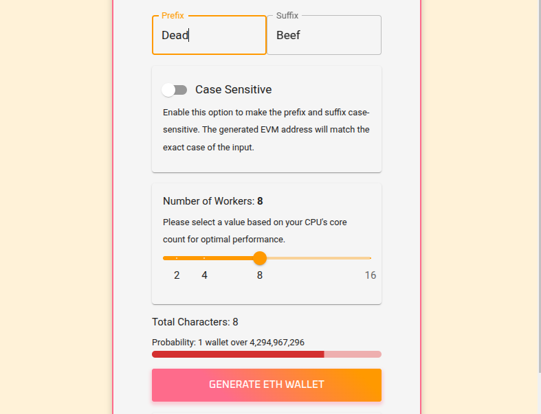
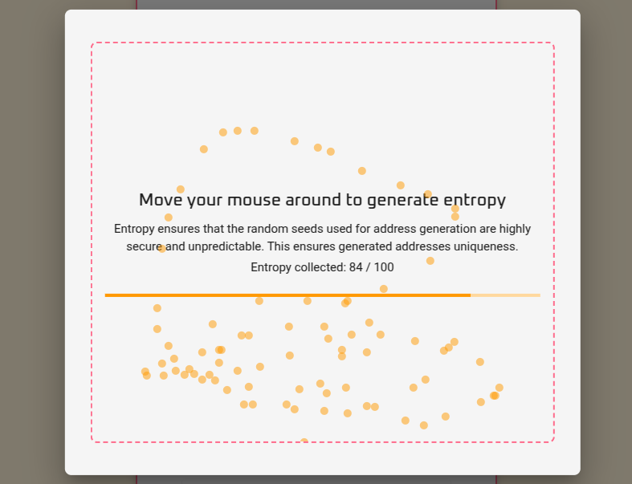
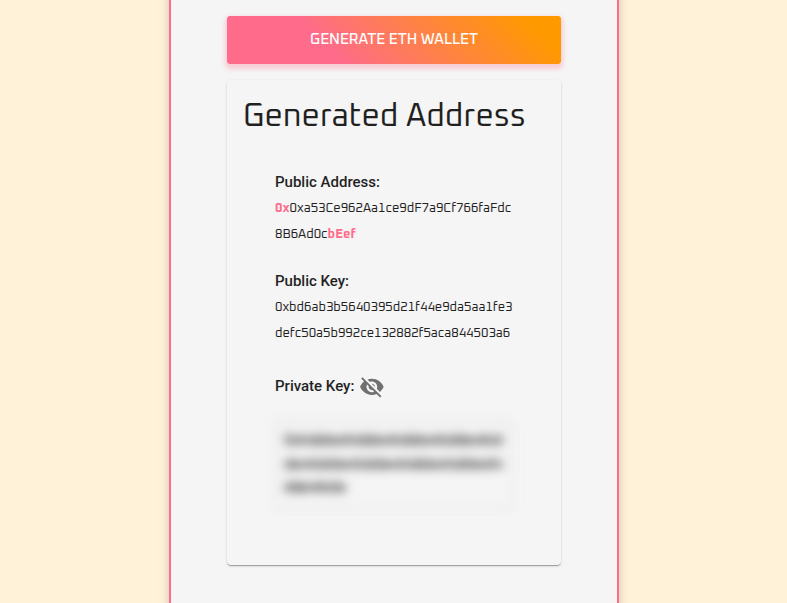

# Prometheus - EVM Vanity Address Generator

Prometheus is a tool for generating Ethereum (or other EVM compatible blockchains) wallet addresses with custom prefixes and/or suffixes. It allows users to create personalized Ethereum addresses while ensuring the security of private keys.

[[LIVE DEMO]](https://prometheus-vanity.vercel.app)

## Features

- Generate Ethereum addresses with custom prefixes and/or suffixes.
- Supports case-sensitive and case-insensitive matching.
- Displays the generated address, public key, and private key.
- Includes a QR code for the private key for easy sharing or storage.
- Dynamic difficulty indicator with a progress bar based on the complexity of the prefix and suffix.
- Uses Web Workers for concurrency to prevent UI freezing during computation.
- Entropy-based randomness: Uses mouse movement to generate entropy for secure and unpredictable seed generation.

## Entropy-Based Randomness

To ensure the highest level of security and randomness, Prometheus introduces **entropy generation**. This feature collects entropy from user mouse movements to create a highly secure and unpredictable seed for wallet generation. 

### Why Use Entropy?

- **Enhanced Security**: Random seeds derived from entropy ensure that the generated private keys are resistant to attacks.
- **Unpredictability**: By using user-generated entropy, the randomness is unique to each session.
- **Client-Side Only**: All entropy collection and seed generation happen locally in your browser, ensuring privacy and security.

## UI Screenshots

| Feature                          | Screenshot                                                 |
|----------------------------------|------------------------------------------------------------|
| **Customization**                |                      |
| **Entropy Collection Modal**     |           |
| **Generated Wallet Details**     |     |


## Installation

1. Clone the repository:
   ```bash
   git clone https://github.com/smolgroot/prometheus-vanity-eth.git
   cd prometheus-vanity-eth
   ```

2. Install dependencies:
   ```bash
   npm install
   ```

3. Start the development server:
   ```bash
   npm start
   ```

## Security

- The private key is generated locally in your browser and is never sent to any server.
- Entropy-based randomness ensures secure and unpredictable seed generation.
- For more security, run Prometheus offline, on a client environment (fresh OS or Virtual Machine) by cloning this repository.
- Always store your private key securely and never share it with anyone.

## Technologies Used

- **React**: For building the user interface.
- **ethers.js**: For Ethereum wallet generation.
- **qrcode.react**: For generating QR codes.
- **Web Workers**: For running address generation in parallel threads to prevent UI freezing.

## License

This project is licensed under the MIT License. See the [LICENSE](LICENSE) file for details.

## Acknowledgments

- Inspired by the need for personalized Ethereum addresses.
- Built with love for the Ethereum community.

---

**Disclaimer**: Use this tool at your own risk. Generating vanity addresses with long prefixes or suffixes may take significant time and computational resources.
